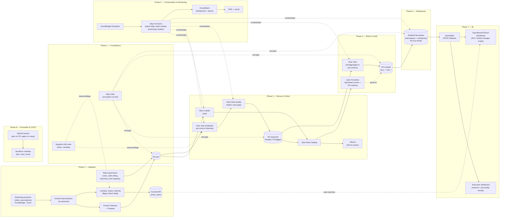
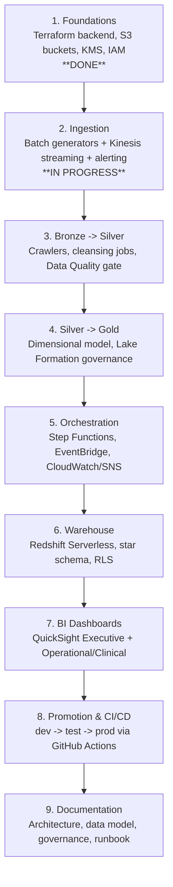

# Meridian Health Network — Architecture

End-to-end AWS analytics platform architecture, organized by delivery phase (see the
9-phase plan). Each subgraph below is tagged with the phase that builds it.

## System architecture (by phase)

## Phase delivery roadmap

## Notes

- Each phase is independently shippable and verified against `dev` before moving on
  (Terraform `plan`/`apply`, manual pipeline run, inspection of actual output — not
  just exit codes).
- Encryption (KMS, TLS in transit) and least-privilege IAM apply across every phase,
  not just Phase 1 — shown as cross-cutting links above.
- See the RFP/plan source for full per-phase acceptance criteria.
